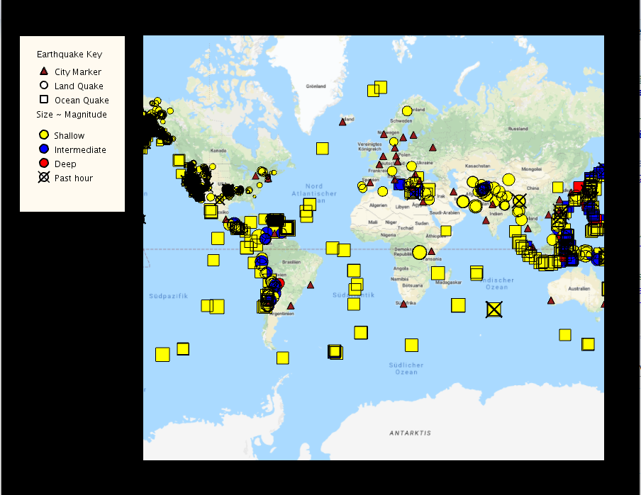

# Coursera-UCSDUnfoldingMaps
Coursework from the Object Oriented Java Specialization.
The program reads from an RSS feed and displays earthquake markers on a map and a key was created to segregate the different types of data. 
When the user hovers over a marker, the application displays features such as location, city, country and population. When a marker is clicked, cities within the threat circle of a surrounding earthquake are isolated. 

    

Topics covered in this course include polymorphism, inheritance, memory models, scope, visualizing data,creating GUI's anddData, event driven programming, searching and sorting algorithms.

Libraries used were Processing and Unfolding Maps. 
